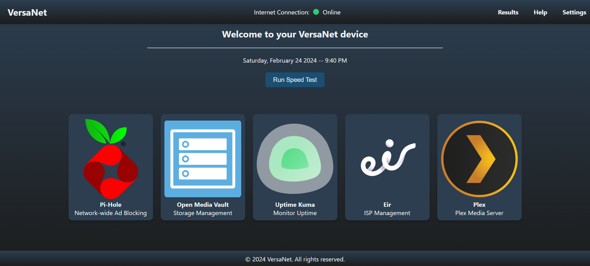

# VersaNet
Repo for all code for VersaNet networking device

## Overview
VersaNet is a comprehensive solution designed to enhance the security, utility, and efficiency of home networks using a Raspberry Pi cluster. This project combines a variety of network management tools into a single device, making it accessible through a user-friendly web interface. The tools include a Network Attached Storage (NAS), ad-blocker, firewall, and a bandwidth tester, allowing users of all technical abilities to manage their home networks effectively.

## Features
Network Attached Storage (NAS): Store and access your files securely across your network.
Ad-Blocker: Improve network speed and enjoy an ad-free browsing experience.
Firewall: Enhance your network security by monitoring and controlling incoming and outgoing network traffic.
Bandwidth Tester: Test the speed of your internet connection directly from your network.

## Getting Started
Prerequisites
To deploy VersaNet, you will need the following:

Raspberry Pi 4 Model B (1 GB/2 GB/4 GB)
SD Card with a minimum of 8 GB storage
Power adapter compatible with Raspberry Pi
Ethernet cable
Computer to access Raspberry Pi over network
Installation
Set Up Raspberry Pi:

Download the Raspberry Pi Imager from the official Raspberry Pi website.
Install Raspberry Pi OS onto an SD card using the imager.
Insert the SD card into your Raspberry Pi, connect it to your network via an Ethernet cable, and power it on.
Accessing Raspberry Pi:

Find the Raspberry Pi on your network. You can do this using a network scanning tool or your router’s device list.
SSH into your Raspberry Pi. Default credentials are typically:
Username: pi
Password: raspberry
Software Installation:

Update your system: sudo apt-get update && sudo apt-get upgrade
Install necessary software like Docker, Pi-Hole, OpenMediaVault, etc., by following the specific installation commands for each.
Configuring VersaNet
Configure each tool using the web interfaces provided:

Pi-Hole: Access the Pi-Hole admin interface via http://[your-pi-ip-address]/admin
OpenMediaVault: Access via http://[your-pi-ip-address]
Plex Media Server: Configure via the Plex web interface to manage and stream your media.
Usage
After setting up and configuring all tools, you can manage your home network through the web interfaces provided by each application. For detailed usage instructions, refer to the documentation for each specific tool.

Contributing
Contributions to VersaNet are welcome! Please read CONTRIBUTING.md for details on our code of conduct, and the process for submitting pull requests.

License
This project is licensed under the MIT License - see the LICENSE.md file for details.

Acknowledgments
Atlantic Technological University
Gerard Mc Cluskey, supervisor
Fellow classmates and technicians who supported this project

Contact
Jack Mac Intyre - L00158710@atu.ie
